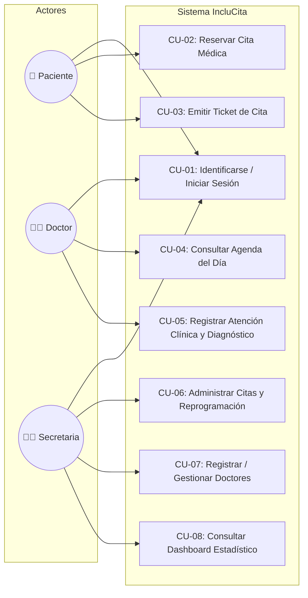
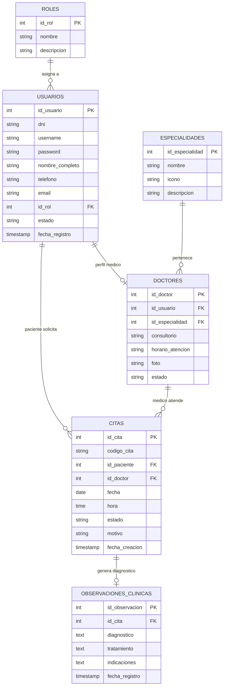
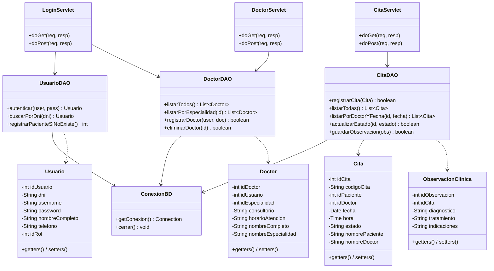

# 📋 INCLUCITA - Documentación Técnica del Sistema (Rúbrica 20/20)

Plataforma Web Inclusiva de Gestión y Reserva de Citas Médicas bajo la arquitectura **MVC (Modelo - Vista - Controlador)** en **Java EE / Jakarta EE**, **Apache Tomcat**, **MySQL** y frontend responsivo con **Bootstrap 5**.

---

## 1. Presentación del Proyecto, Sistema, Roles y Funciones (2 Pts)

### 1.1. Problemática y Propósito
El acceso a la atención médica suele presentar barreras significativas para personas de la tercera edad, personas con discapacidad visual o motriz, y quechuahablantes. **IncluCita** nace para eliminar estas barreras mediante una interfaz limpia, botones táctiles de gran escala, soporte de teclado numérico asistido y **reconocimiento de voz bidireccional (Web Speech API)** en español y quechua.

### 1.2. Roles y Matriz de Funcionalidades

| Rol | Objetivo Principal | Funcionalidades Clave |
| :--- | :--- | :--- |
| **Paciente** | Reserva ágil e inclusiva de citas médicas | - Identificación por DNI mediante teclado numérico o voz. - Selección interactiva de especialidad médica. - Elección de fecha y turno horario. - Confirmación y emisión inmediata de Comprobante / Ticket. - Consulta y cancelación de citas previas. |
| **Doctor** | Gestión clínica y seguimiento de pacientes | - Inicio de sesión seguro con DNI / credenciales. - Visualización de agenda médica y pacientes citados del día. - Registro de atención médica (diagnóstico clínico, receta y tratamiento). - Historial de atenciones realizadas. |
| **Secretaria (Admin)** | Administración operativa del centro médico | - Control total de citas (filtrado por fecha, estado y paciente). - Cancelación y reprogramación de citas médicas. - Alta (registro) y baja de médicos y consultorios. - Dashboard estadístico de atenciones y rendimiento por especialidad. |

---

## 2. Diagrama y Especificación de Casos de Uso (4 Pts)

### 2.1. Diagrama General de Casos de Uso (UML)

---

### 2.2. Fichas de Especificación de Casos de Uso Principales

#### **CU-02: Reservar Cita Médica**
* **Actor Principal**: Paciente.
* **Precondición**: El paciente debe haber ingresado su DNI (mediante pantalla táctil o reconocimiento de voz).
* **Flujo Principal**:
  1. El sistema muestra la lista de especialidades médicas activas (`EspecialidadDAO`).
  2. El paciente selecciona una especialidad.
  3. El sistema muestra el calendario de fechas disponibles.
  4. El paciente selecciona una fecha y un horario de atención disponible.
  5. El sistema presenta el resumen de la cita para confirmación.
  6. El paciente confirma la cita.
  7. El controlador `CitaServlet` persiste la cita en la tabla `citas` de MySQL con estado `PENDIENTE`.
  8. El sistema redirige a `ticket.jsp` mostrando el código único y los datos del JavaBean `Cita`.
* **Flujo Alternativo**:
  - *4a. Horario no disponible:* El sistema alerta al paciente que el turno ya fue tomado y solicita seleccionar otro horario.

#### **CU-05: Registrar Atención Clínica y Diagnóstico**
* **Actor Principal**: Doctor.
* **Precondición**: Doctor con sesión iniciada y cita asignada en estado `PENDIENTE`.
* **Flujo Principal**:
  1. El doctor accede a su agenda (`doctorAgenda.jsp`).
  2. El sistema lista las citas programadas para el doctor en la fecha actual.
  3. El doctor selecciona al paciente y presiona *"Atender / Diagnosticar"*.
  4. Se abre la ventana modal de atención clínica.
  5. El doctor ingresa el diagnóstico, tratamiento e indicaciones.
  6. El doctor confirma el guardado.
  7. `CitaServlet` guarda el registro en la tabla `observaciones_clinicas` y actualiza el estado de la cita a `ATENDIDA`.
  8. La interfaz actualiza el estado del paciente a color verde (*ATENDIDA*).

#### **CU-07: Registrar Nuevo Doctor**
* **Actor Principal**: Secretaria / Administrador.
* **Precondición**: Sesión iniciada con rol de Secretaria.
* **Flujo Principal**:
  1. La secretaria ingresa a la opción *"Registrar Doctor"*.
  2. Completa los datos personales (DNI, nombres, teléfono, correo) y laborales (especialidad, consultorio, horario).
  3. Envía el formulario atendido por `DoctorServlet`.
  4. El servlet ejecuta una transacción JDBC en `DoctorDAO`: crea el `Usuario` con rol `DOCTOR` y el registro en la tabla `doctores`.
  5. El sistema notifica el éxito del registro y el médico queda habilitado para recibir citas.

---

## 3. Diagrama de Clases y Modelo de Datos Relacional (4 Pts)

### 3.1. Modelo Entidad-Relación de la Base de Datos (DER)

---

### 3.2. Diagrama de Clases UML (Arquitectura MVC)

---

## 4. Guía de Puesta en Marcha (NetBeans + Tomcat + MySQL)

### Paso 1: Importar la Base de Datos en MySQL (XAMPP)
1. Inicie **Apache** y **MySQL** desde el panel de control de **XAMPP**.
2. Abra su navegador e ingrese a `http://localhost/phpmyadmin`.
3. Cree una base de datos llamada `inclucitadb` (cotejamiento `utf8mb4_unicode_ci`).
4. Vaya a la pestaña **Importar** y seleccione el archivo:
   `IncluCitaWeb/database/database.sql`
5. Haga clic en **Continuar / Importar**.

### Paso 2: Abrir y Ejecutar el Proyecto en Apache NetBeans
1. Abra **Apache NetBeans**.
2. Vaya a **File → Open Project...** y seleccione la carpeta `IncluCitaWeb` (reconocida con icono de proyecto Maven).
3. Asegúrese de que su servidor **Apache Tomcat 10.x** esté registrado en *Tools → Servers*.
4. Clic derecho en el proyecto `IncluCita` → **Properties → Run**:
   - Server: *Apache Tomcat 10.x*
5. Clic derecho en el proyecto → **Run** (o presione **F6**).
6. NetBeans desplegará el WAR en Tomcat y abrirá automáticamente:
   `http://localhost:8080/IncluCitaWeb/`

### Credenciales de Demostración
* **Secretaria**: DNI `72527818` / Clave `123456` (o usuario: `secretaria` / pass: `secretaria123`)
* **Médico General**: DNI `10000001` (Dr. Luis Ramírez)
* **Médico Pediatra**: DNI `10000002` (Dra. María López)
* **Paciente**: DNI `12345678` (Juan Carlos Pérez)
